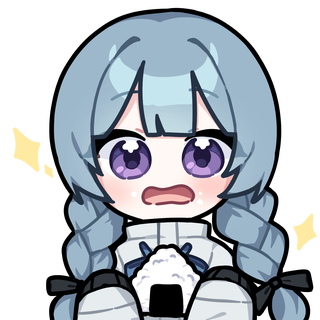

<p align="center">
  <a href="https://mandii.me/" target="blank"></a>
</p>

[circleci-image]: https://img.shields.io/circleci/build/github/nestjs/nest/master?token=abc123def456
[circleci-url]: https://circleci.com/gh/nestjs/nest

  <p align="center">A progressive <a href="https://mandii.me" target="_blank">mandii</a> beacon for friendii</p>
    <p align="center">
<a href="https://nodejs.org/ko/blog/release/v14.16.1" target="_blank"></a>
<a href="https://www.npmjs.com/package/npm/v/6.14.12" target="_blank"></a>
<a href="https://opensource.org/license/mit/" target="_blank"></a>

<a href="https://github.com/twitch-6600/mandii/issues" target="_blank"></a>
<a href="https://mandii.me/cafe"  target="_blank"></a>
</p>

## Description

[Nest](https://github.com/nestjs/nest) framework [Mandii](https://mandii.me/) repository.

## Installation

```bash
$ npm install
```

## Running the app

```bash
# development
$ npm run start

# production mode
$ npm run start:prod
```

## License

Mandii is [MIT licensed](LICENSE).
